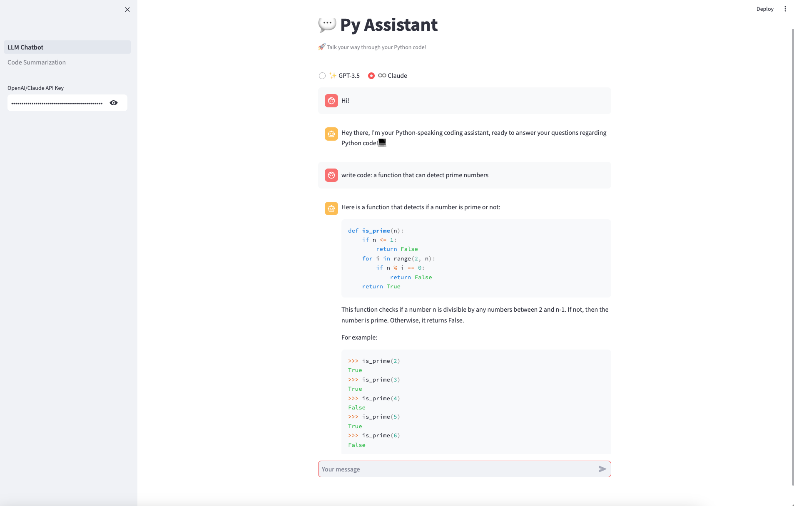
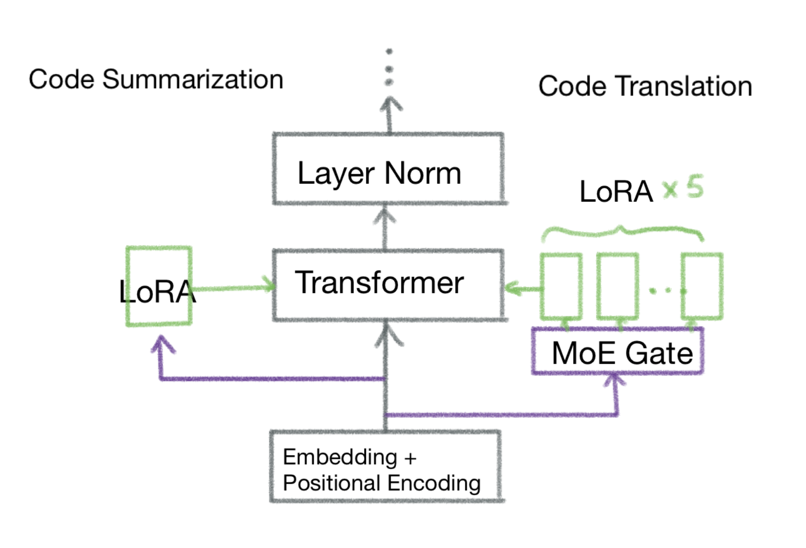

# py-assistant

Py-assistant is an interactive chatbot specifically focusing on Python. Our goal is to: 1. Classify user's prompt as code summarization, code translation, or code generation; 2. Proceed with the described task in only one open-source model.

Our progress is described as the following:

Sprint 1:
* Progress: We built basic UI namely "LLM Chatbot" and "Code Summarization". We made decisions on the LLM we will use.
    * For "LLM Chatbot" interface, the user can choose to use openai as a client or to use claude. Since we have not received credits from openai, our demo will be focusing on displaying py-assistant with anthropic. 
    * For "Code Summarization", the user can choose the mode of interacting with py-assistant. Specifically, the user can choose either chat with py-assistant or submit a .py or .txt file.
    * Decision on LLM model for py-assistant: we will use StarCoder (https://arxiv.org/abs/2305.06161) and SteloCoder (https://arxiv.org/abs/2310.15539). It is a 15.5B model focusing on python code. StarCoder is designed as Python code generation assistant, and SteloCoder is designed as 5 Programming Language to Python translation. In the end, we will seek ways to merge the three fine-tuned model together to optimize memory usage.
* Contributions:
    * Tess works on building the streamlit app 'LLM Chatbot.py' with OpenAI as the backend model, as well as adding the page 'Code_Summarization.py' that allows users to upload code files directly into the app for code summarization.
    * Joyce works on adding functionality of choosing which LLM model to use on the backend (openai or claude) for 'LLM Chatbot.py', as well as adding functionality of choosing user interaction mode (chat mode or file input) for 'Code_Summarization.py'
    * Both of the teammates research on state-of-the-art LLMs and choose which LLM to use for backend in the future.
* Notes on progress:
    * For "LLM Chatbot" interface, our next step is to modify it to first classify user's prompt and then proceed with the identified task.
    * We are going to build other interfaces. Specifically, other than "Code Summarization", we will build "Code Generation", and "Code Translation". In the end, the user can choose to use the unified mode (LLM Chatbot) or task designated mode (one of the three interfaces mentioned above).

Sprint 2:
* Progress & Contributions:
    * Tess: 
    1) Built the "Code_Translation.py" page, designed to enable users to either upload code files or interact with a LLM to translate Python code into Java, C++, JavaScript, or Go. Specifically, this page will execute a two-step process based on user input. First, it will run a pre-check to make sure that the provided Python code is suitable for translating into the target language. If the code is deemed suitable, the translation process is initiated. Otherwise, the process will be halted.
    2) Modified the page "LLM Chatbot.py" so that it will first classify user prompt into code generation, code summarization, or code translation. Then, the chatbot will proceed with the identified coding task.
    3) Future plan: Tess will further enrich the LLM Chatbot page so that it will support more sophisticated functionality based on the identified task. Tess will also modify the file upload section in the Code_Summarization.py page to enable RAG functionality, so that the app will retrieve relevant information from the uploaded file and generate more precise answers.
    
    * Joyce:
    Majorly focused on fine-tuning StarCoder for Code Summarization. 
    1) Preprocessed the XLCoST dataset and outputs training/val/test dataset for python code - summarization pairs. 
        * Datasets description: The raw dataset is from XLCoST dataset which is a comprehensive dataset focusing on all tasks of coding. The original dataset is stored in 'finetune code summarization/datasets_summarization/pair_data_tok_1_comment/Python-comment' for code snippets summarization and 'finetune code summarization/datasets_summarization/pair_data_tok_full_desc/Python-comment' for python programs. 
        * Processed dataset: The output file is stored in 'finetune code summarization/datasets_summarization/process_data'. For snippet level python code summarization, we have 81.2K training pairs, 3.9K validation data pairs, and 7.3K test data pairs. For program level samples, we have 9.3K training pairs, 472 validation pairs, and 887 test pairs. All files are stored in .json format and can be passed in fine-tuning datasets. One observation for the dataset is that there is some noise, meaning that there are some samples that inaccurately summarize the actual python code. However, the chances of noise are low, so we ignore this issue.
        * Notebook: The notebook for data preprocessing is named as 'data_preprocessing.ipynb'. 
    2) Completed the script for fine-tuning StarCoder on code summarization. 
        * The major components include: 
            a) an IterableDataset named SummarizationDataset. Basically, it takes json file (as what we preprocessed), encodes the samples, transfers into the data used in final training step.
            b) Low-Rank Adaptation method (LoRA):  We cite from the paper LoRA: Low-Rank Adaptation of Large Language Models (https://arxiv.org/abs/2106.09685). It claims that when we fine-tune, we only need to modify the first few ranks of the matrices. In practice, it yields good result with high efficiency in terms of time and storage. In the end, we only need to save LoRA metrices which is only 0.05% of total number of parameters. We can use lora in peft implemented by huggingface.
            c) Normal training config
    3) Future work: Due to the complications for credits, we are not able to perform fine-tuning. After receiving the credits, we are going to fine-tune StarCoder on code summarization, get the LoRA matrices, and merge them into StarCoder along with code translation and generation tasks.

Sprint 3:
* Progress & Contributions:
    * Tess: 
        1) Successfully implemented the Retrieval-Augmented Generation (RAG) functionality on the "Code_Summarization" page utilizing LangChain. This enhancement allows users to upload multiple files for embedding, enabling the RAG system to efficiently retrieve the most relevant documents based on a user's query. Consequently, this system provides precise answers by leveraging the context provided by the user's input with the LLM of choice. Moreover, the RAG system has memory for past chat history, allowing users to maintain a continuous conversation with the chatbot.
        2) Demo day plan: Tess will include further developments to the LLM Chatbot page. Should our efforts to fine-tune our model for the final demo prove successful, Tess will integrate this optimized model for the specified tasks. Additionally, Tess is set to expand the chatbot's functionality by incorporating advanced prompting techniques, such as the Chain-of-Thought approach, to enhance its utility and user experience. On the demo day, Tess will showcase the capabilities of Py-assistant end-to-end, using different LLM backends for specific coding tasks.
    * Joyce:
        1) 1.1 Created ”Code_Generation" page that can generate Python code under users instruction. Similar to all the previous page, the user can upload a file or use the chatbot. Also, it will first check if user's instruction is suitable to perform human language to python translation and then generate Python code for the user. 1.2 Completed "intergrated py-assistant LLM" architecture. Basically, SteloCoder is capable to perform 5 programming language to Python translation. Built on that, our LLM has 6 experts. The first 5 are used to detect which language the input is and output the translated code, while the 6th one is used to perform code summarization. Code generation can be performed without any LoRA merging. (Model Architecture attached below, code architecture is in 'limited setting llm/modeling_gpt_bigcode.py')
        Note: we are not able to complete fine-tuning since we still have limits on GPU usage.
        2) Demo day plan: Joyce will include prompting techniques and RAG into py-assistant according to different use cases and scenerios. Joyce will also add instructions for using py-assistant.
    
    

Final Demo:
* Progress & Contributions:
    * Tess: 
        1) Following the feedback from Sprint 2, I've restructured the essential functions of the LLM Chatbot into chatbot_utilities.py. This update has effectively modularized critical LLM operations, like answer generation and user intent analysis, into callable functions. This modification has significantly enhanced the codebase's readability and maintainability. Consequently, we've managed to reorganize the repetitive interactions with both OpenAI and Anthropic models as a unified segment of code. This adaptation has been implemented across the main page, as well as the modules for code generation, code translation, and code summarization.
        2) For the RAG system, I have introduced a feature for collecting feedback from users. This functionality allows users to submit their feedback on each response, which can then be tracked in LangSmith through an external link. This improvement aids in monitoring the LLM agent in terms of speed and response quality, and will offer valuable insights into potential system enhancements based on user input.
    * Joyce:
        1) Crawled code base from Google Cloud Platform repos and implemented the Retrieval-Augmented Generation (RAG) functionality with crawled code base as the retrieval knowledge on "Code Generation" page. However, it did not work well because: first, Python is very popular, and the backbone LLM must have been trained a lot on Python data, and second, the code base has too much noise, not just focusing on Python but on every topic like multi-modal models. We might try out with different embeddings in the future, so we decided to left the code in place but commented out.
        2) Moreover, we organized code into functions and classes for all chatbot pages. Specifically, I processed 'Code Generation' page and move utility functions to 'src/chatbot_utilities.py'. 
        3) Lastly, I modified LLM Chatbot so that if the user is a Python beginner, the chatbot can produce tutorials on Python.

* Future work: For RAG, we will test on some other embeddings and fine Python-focused code bases. In addition, we are going to fine-tune our constructed LLM to support users with low resource settings.

* Testing Instruction:
    * LLM Chatbot: Both beginners or Python developers are welcome to use this page. If the user is a beginner, then Py-Assistant can walk through basic python tutorials and code. If the user is a Python developer that wants to perform specific task, then the chatbot can first search for user's intent (code generation, summarization, or translation), then produce related answers for the user.
    * Code Translation: To evaluate the capabilities of our code translator, users are encouraged to initially present the chatbot with a Python script that incorporates distinct Python libraries (like OpenAI), enabling the chatbot to determine its incompatibility for translation to the chosen target language. 
    Subsequently, users should submit a Python file featuring an object-oriented programming structure to the chatbot, which will allow for an accurate translation of the content into the corresponding language of choice.
    * Code Summarization: We invite users to explore the capabilities of the Retrieval-Augmented Generation (RAG) feature by uploading 3-4 Python files and posing a specific question concerning the code. Following this, users will experience the RAG system in action, as it responds to the query using retrieved source documents to provide context and deliver accurate answers. Finally, users now have the opportunity to provide feedback on each response from the LLM, and can track the system's speed and performance through LangSmith.
    * Code Generation: We invite users to explore the capabilities of code generator, users can either use chatbot to communicate with py-assistant or upload a file that contains users prompt. The py-assistant will first detect if the prompt is indeed description about programming code functionalities and then output the generated Python code correspondingly.
